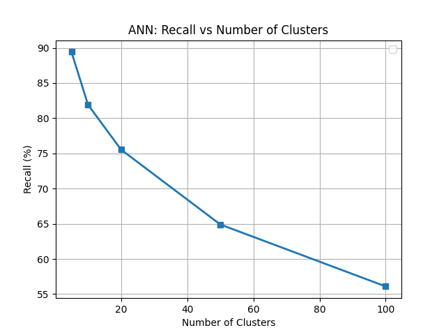
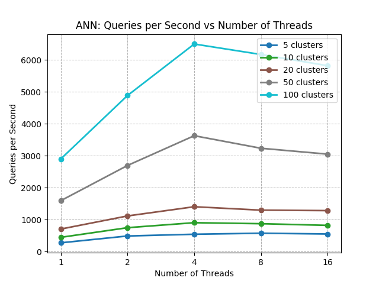

# a2a-ann


**a2a-ann** is a high-performance C library for solving the **All-to-All Approximate Nearest Neighbors (A2A-ANN)** problem. It includes highly parallelized implementations of both:

- **All-to-All Approximate Nearest Neighbors**
- **k-Nearest Neighbors (k-NN)**

The library is optimized for multicore systems using:
- **POSIX Threads (pthreads)**
- **OpenBLAS**
- **OpenMP** (default secondary parallelization method)
- **OpenCilk** (alternative secondary parallelization method)

---

## Table of Contents

- [Requirements](#requirements)
- [Project Structure](#project-structure)
- [Build Instructions](#build-instructions)
  - [Building the Library (Release)](#building-the-library-release)
  - [Building with Tests and Benchmarks (Debug)](#building-with-tests-and-benchmarks-debug)
- [Running Tests](#running-tests)
- [Running Benchmarks](#running-benchmarks)
  - [KNN Benchmarks](#knn-benchmarks)
  - [ANN Benchmarks](#ann-benchmarks)
- [Valgrind](#valgrind)
  - [Install Valgrind](#install-valgrind)
  - [Running Valgrind](#running-valgrind)

---

## Requirements

- **C standard** >= **C11**
- **CMake** >= 3.10
- **OpenBLAS**
- **OpenMP** (enabled by default unless OpenCilk is used)
- **OpenCilk** (can be enabled via a CMake option)
- Optional: **HDF5** (required for running tests and benchmarks in `Debug` configuration)
- Optional: **Python 3** (required for running tests and benchmarks in `Debug` configuration)

---

## Project Structure

- **`.github/`**  
  Contains GitHub Actions workflows for continuous integration and deployment (CI/CD).

- **`.vscode/`**  
  Configuration files to facilitate quick and consistent setup in the VSCode development environment.

- **`benchmarks/`**  
  Contains benchmarking tools and implementations for both k-NN and A2A-ANN algorithms.

- **`docs/`**  
  Documentation, figures, and plots generated from benchmark results.

- **`include/`**  
  Public header files exposing the core library’s API.

- **`src/`**  
  Source files implementing the core functionality of the ANN and k-NN algorithms.

- **`tests/`**  
  Unit and integration tests for verifying the k-NN implementation.

- **`utils/`**  
  Shared utility functions and helper code used across tests and benchmarks.

- **`valgrind/`**   
  Scripts and configuration files for memory analysis using Valgrind.

---

## Build Instructions

This project supports two build configurations:

| Build Type | Description                       | Dependencies                 | `USE_OPENCILK` flag  | `PRECISION` flag  |
|------------|-----------------------------------|------------------------------|----------------------|-------------------|
| `Release`  | Build the standalone library only | OpenBLAS + (OpenMP/OpenCilk) | `ON`/`OFF` (default) | `SINGLE`/`DOUBLE` (default) |
| `Debug`    | Build tests and benchmarks        | OpenBLAS + OpenMP + HDF5     | `OFF`                | Not used          |

- In `Release` mode, by default, the library uses **OpenMP** as a secondary parallelization method. You can optionally 
enable **OpenCilk** by setting the `USE_OPENCILK` flag to `ON`. Only one secondary parallelization method can be used at 
a time.

- In `Release` mode, you can specify the precision of the library by setting the `PRECISION` flag to `SINGLE` or `DOUBLE`.
The default configuration is `DOUBLE`.

- You can select the build mode using the `CMAKE_BUILD_TYPE` flag.

---

### Building the Library (Release)

**Build with OpenMP (default)** 

By default, the library uses **OpenMP** for parallelization. Make sure to use a compiler that supports **OpenMP**, 
such as GCC:
```bash
CC=gcc cmake -S . -B build -DCMAKE_BUILD_TYPE=Release -DPRECISION=SINGLE
cmake --build build
```

**Optional: Build with OpenCilk**

To use **OpenCilk** instead of OpenMP, enable the `USE_OPENCILK` option. You must use a compiler with **OpenCilk** 
support, such as a custom-built **clang** from the [OpenCilk project](https://opencilk.org/):

```bash
CC=/path/to/opencilk/bin/clang cmake -S . -B build -DCMAKE_BUILD_TYPE=Release -DPRECISION=SINGLE -DUSE_OPENCILK=ON
cmake --build build
```
Theese will compile the static library `liba2ann.a` in `build/`.

### Building with Tests and Benchmarks (Debug)

Make sure to use a compiler that supports **OpenMP**, such as GCC:
```bash
CC=gcc cmake -S . -B build -DCMAKE_BUILD_TYPE=Debug
cmake --build build
```
> Note: In `Debug` configuration the `PRECISION` and `USE_OPENCILK` flags are not used.

You also need to install the Python dependencies for the test and benchmark scripts:
```bash
pip install -r requirements.txt
```

## Running Tests

After building the project in `Debug` mode, you can run the test suite as follows:
```bash
cd tests
chmod +x run_tests.sh
./run_tests.sh
```
This script will automatically generate test datasets using Python 3 and execute the tests to 
verify the correctness of the implementation.

## Running Benchmarks
Benchmarks were conducted on Ubuntu 22.04 LTS using a 4-core machine and the
[MNIST dataset](https://github.com/erikbern/ann-benchmarks).

### KNN Benchmarks
After building in `Debug` mode, run the benchmark script
```bash
cd benchmarks/knn-benchmarks
chmod +x run_knn_benchmarks.sh
./run_knn_benchmarks.sh <path/to/dataset>
```
- The benchmark output will be saved to: `benchmarks/knn-benchmarks/knn_benchmark_output.hdf5`
- The benchmark plot will be saved to: `docs/figures/knn_throughput_vs_threads.png`. 

You may also run benchmarks using a custom .hdf5 dataset. The dataset must include the 
following fields:

- `/train`: Corpus matrix, single precision, row-major order
- `/test`: Query matrix, single precision, row-major order
- `/neighbors`: Ground truth indices (int32), row-major order


### ANN Benchmarks
After building in `Debug` mode, run the following
```bash
cd benchmarks/ann-benchmarks
chmod +x run_ann_benchmarks.sh
./run_ann_benchmarks.sh <path/to/dataset>
```
To use a custom .hdf5 dataset, ensure it follows the same format as used in the KNN benchmarks. 
The benchmark process is the following:

- The `train/` and `test/` matrices are being concatenated.
- The exact all-to-all neighbors are computed.
- The value of `K` corresponds to the number of columns in the `neighbors` matrix.

The benchmark output is then validated against the exact solution, and the following files 
are generated:

- Benchmark results: `benchmarks/ann-benchmarks/ann_benchmark_output.hdf5`
- Recall vs. number of clusters plot: `docs/figures/ann_recall_vs_clusters.png`.
- Throughput vs. number of threads plot: `docs/figures/ann_throughput_vs_threads.phg`.




## Valgrind

Valgrind is used to detect memory leaks and invalid memory accesses in the codebase. 
To use Valgrind, you first need to install it on your system.

### Install Valgrind

**On Ubuntu/Debian:**
```bash
sudo apt update
sudo apt install valgrind
```

**On macOS (using Homebrew):**
```bash
brew install valgrind
```
> Note: Valgrind's support on macOS is limited and may not be available or fully functional 
on newer macOS versions.

### Running Valgrind
After building the project in `Debug` mode, run the provided script:
```bash
cd valgrind
chmod +x run_valgrind.sh
./run_valgrind.sh
```
You can review `valgrind_knn_example.log` and `valgrind_ann_example.log` files
to identify memory leaks, invalid reads/writes, or other memory-related issues.
