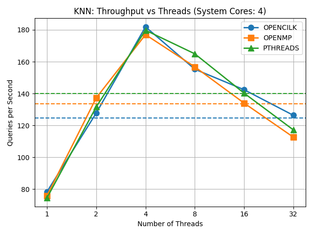

# all2all-ann
---


**all2all-ann** is a high-performance C library for solving the **All-to-All Approximate Nearest Neighbors (A2A-ANN)** problem. It includes highly parallelized implementations of both:

- **All-to-All Approximate Nearest Neighbors**
- **k-Nearest Neighbors (k-NN)**

The library is optimized for multicore systems using:
- **POSIX Threads (pthreads)**
- **OpenBLAS**
- Optional: **Python 3** and **HDF5** for testing and benchmarking utilities

---

## Requirements

- **CMake** >= 3.10
- **OpenBLAS**
- **Python 3** (required for `DEBUG` configuration -- used in tests and benchmarks)
- **HDF5** (required for `DEBUG` configuration)

---

## Project Structure

- **`benchmark/`**  
  Contains benchmarking tools and implementations for both k-NN and A2A-ANN algorithms.

- **`docs/`**  
  Documentation, figures, and plots generated from benchmark results.

- **`include/`**  
  Public header files for the core library.

- **`src/`**  
  Source files implementing the core functionality of the ANN and k-NN algorithms.

- **`test/`**  
  Unit and integration tests for verifying the k-NN implementation.

- **`util/`**  
  Shared utility functions and helper code used across tests and benchmarks.


## Build Instructions

This project supports two build configurations:

| Build Type     | Description                           | Dependencies               |
|----------------|---------------------------------------|----------------------------|
| `RELEASE`      | Build the standalone library only     | OpenBLAS                   |
| `DEBUG`        | Build tests and benchmarks            | OpenBLAS + HDF5 + Python 3 |

You can select the build mode using the `BUILD_CONFIGURATION` flag.

---

### Building the Library (RELEASE)

You can specify the precision of the library by setting the `PRECISION` flag to `SINGLE` or `DOUBLE`.
The default configuration is `DOUBLE`.

```bash
cmake -S . -B build -DBUILD_CONFIGURATION=RELEASE -DPRECISION=SINGLE
cmake --build build
```
This will compile the static library `libann.a` in `build/`.

### Building with Tests and Benchmarks (DEBUG)

```bash
cmake -S . -B build -DBUILD_CONFIGURATION=DEBUG
cmake --build build
```
You have also to install the dependencies for the python scripts:
```bash
pip install -r requirements.txt
```

## Running Tests

After building in `DEBUG` mode:
```bash
cd test
chmod +x run_tests.sh
./run_tests.sh
```
This will automatically generate test files using Python 3 and run tests against those datasets to 
verify correctness.

## Running Benchmarks
Benchmarks were conducted on Ubuntu 22.04 LTS using a 4-core machine and the
[MNIST dataset](https://github.com/erikbern/ann-benchmarks).

### KNN Benchmarks
After building in `DEBUG` mode, run the benchmark script
```bash
cd benchmark/knn-benchmark
chmod +x run_knn_benchmarks.sh
./run_knn_benchmarks.sh <path/to/dataset>
```
- The benchmark output will be saved to: `benchmark/knn-benchmark/knn_benchmark_output.hdf5`
- The benchmark plot will be saved to: `docs/figures/throughput_vs_threads.png`. 

You may also run benchmarks using a custom .hdf5 dataset. The dataset must include the 
following fields:

- `/train`: Corpus matrix, single precision, row-major order
- `/test`: Query matrix, single precision, row-major order
- `/neighbors`: Ground truth indices (int32), row-major order



### ANN Benchmarks
Again, after building in `DEBUG` mode, run the following
```bash
cd benchmark/ann-benchmark
chmod +x run_ann_benchmarks.sh
./run_ann_benchmarks.sh <path/to/dataset>
```